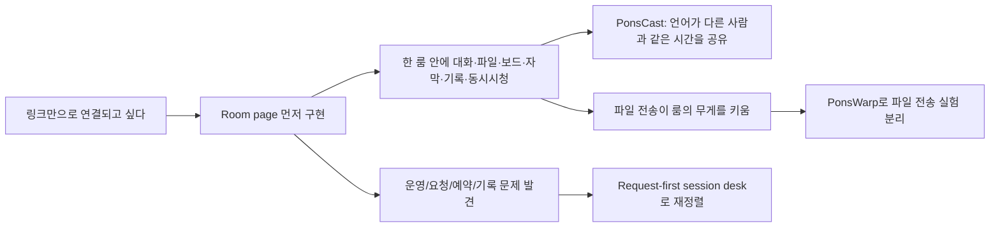
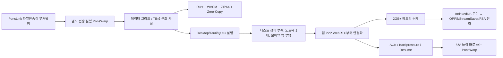

# PonsLink · PonsWarp 확장 스토리 삽입 설계 + Reddit QA

- 작성일: 2026-06-29
- 대상: `blog.ponslink.com`의 PonsLink / PonsWarp 연재
- 참고 프로젝트:
  - `/home/declan/Documents/Develop/Project/아카이브/pons/Pons-Link`
  - `/home/declan/Documents/Develop/Project/아카이브/pons/ponslink_signal`
  - `/home/declan/Documents/Develop/Project/아카이브/pons/pons-link-backend`
  - `/home/declan/Documents/Develop/Project/pons_p2p/ponslink-room-frontend`
  - `/home/declan/Documents/Develop/Project/ponswarp/PonsWarp`
  - `/home/declan/Documents/Develop/Project/ponswarp/pons-core-wasm`
  - `/home/declan/Documents/Develop/Project/ponswarp/ponswarp-signaling-rs`
  - `/tmp/declan-github-pons/ponswarp-desktop`
  - `/tmp/declan-github-pons/ponswarp-signal`
- 이전 문서: `docs/ponslink-ponswarp-blog-insertion-storyline-2026-06-29.md`

## 0. 이번 확장의 결론

기존 설계는 PonsLink와 PonsWarp를 “두 프로젝트의 기술 회고”로는 설명했지만, 왜 둘이 갈라졌는지, 왜 Rust/WASM까지 갔는지, 왜 다시 웹 P2P로 돌아왔는지, 그리고 PonsCast가 왜 회의방 안에 들어왔는지의 인간적인 원인이 약했다.

이번 설계에서는 공개 글의 중심을 이렇게 다시 잡는다.

1. **PonsLink는 링크 하나로 부담 없이 연결되고 싶은 욕구에서 출발했다.**
   - 개인정보를 먼저 요구하지 않고, 링크만으로 들어와 말하고, 보고, 그리고, 기록하고, 필요한 파일을 주고받는 “하나의 룸”을 만들고 싶었다.
2. **PonsLink의 룸은 처음부터 단순 화상회의가 아니라 관계의 작업대였다.**
   - 파일 전송, 화이트보드, 통역, 회의록, CoWatch, PonsCast가 붙은 이유는 기능 욕심이 아니라 “대화 중 생기는 부가 행동을 다른 앱으로 흩뜨리지 않기 위해서”였다.
3. **PonsCast는 개인적인 문제에서 나온 기능이다.**
   - 언어가 다른 가까운 사람과 같은 파일·영상·취미를 같은 시간에 보고 싶었다. 말이 완벽히 통하지 않으니, 같은 화면과 각자의 언어가 필요했다. 이 경험을 공개 글에 넣되, 사적인 디테일을 과시하지 말고 “왜 동시 시청과 자막/통역이 같은 룸에 있어야 했는지”로 연결한다.
4. **PonsWarp는 PonsLink의 파일전송 부담을 따로 떼어낸 실험 서비스다.**
   - PonsLink 안의 파일 전송은 룸 경험을 무겁게 만들었다. 그래서 TB급 전송을 목표로 하는 데이터 그리드/스트리밍 전송 실험을 별도 서비스로 분리했다.
5. **Rust/WASM은 멋있어 보여서가 아니라 브라우저 파일 전송의 병목을 만나서 들어왔다.**
   - ZIP64, 재정렬 버퍼, Zero-Copy, 암호화, GC/메모리 압박, 4GB+ 아카이브 문제를 JS만으로 밀어붙이기 어렵다고 판단한 흔적이 있다.
6. **PonsWarp Desktop은 방향이 틀린 게 아니라 테스트 비용이 너무 컸던 중간 기착지다.**
   - 데스크탑 앱은 Tauri/Rust/QUIC 기반으로 100GB+ 직접 전송을 지향했지만, 실제 테스트하려면 여러 기기가 필요했다. 개발자는 노트북이 한 대뿐이었고, 스마트폰 테스트를 하려면 모바일 앱까지 필요해졌다. 그래서 “우선 웹에서 WebRTC P2P를 안정화하고 사람들이 바로 쓰게 하자”로 돌아온다.
7. **PonsWarp의 진짜 드라마는 ACK, 백프레셔, 브라우저 저장소다.**
   - 2GB 이상 파일이 브라우저 메모리에 올라가 터지는 문제, IndexedDB 고려 흔적, OPFS/StreamSaver/File System Access API의 선택, receiver 저장 완료와 sender bufferedAmount가 다르다는 깨달음, partition ACK와 backpressure tuning이 핵심 서사다.

> 공개 글 규칙: 커밋 번호와 함수명은 본문에 넣지 않는다. 이 문서의 커밋/파일명은 내부 근거로만 쓴다.

---

## 1. 전체 연재의 새 스토리라인

### 1.1 PonsLink 메인 아크

PonsLink 글은 “기능을 많이 넣었다”가 아니라 “링크 하나로 들어온 사람이 한 방 안에서 대화를 끝까지 마칠 수 있게 하려다 보니 룸이 점점 커졌다”로 읽혀야 한다.

#### PonsLink에서 반드시 들어가야 할 장면

- **첫 장면:** 개인정보나 계정부터 요구하지 않고 링크만으로 만나는 경험.
- **Room-first:** 처음 작업의 중심이 룸 페이지였다는 점. 한 방에서 모든 커뮤니케이션이 끝나야 한다는 제품 감각.
- **Feature sprawl의 재해석:** 파일전송/화이트보드/통역/회의록/PonsCast는 욕심이 아니라 “대화의 맥락을 끊지 않기 위한 기능”이었다.
- **PonsCast:** 일본어/한국어처럼 언어 장벽이 있는 관계에서 같은 파일과 취미를 같은 시간에 보고 싶었던 문제. 공개 글에서는 “가까운 사람” 또는 “언어가 다른 상대” 정도로 톤을 조절한다.
- **파일전송의 분리:** 룸 안의 파일전송이 독립 제품으로 갈 만큼 깊어졌고, 그 결과가 PonsWarp다.
- **Request-first 전환:** 룸 자체가 완성되어도 운영, 요청, 예약, 기록이 없으면 제품이 되지 않는다는 후반부 깨달음.

### 1.2 PonsWarp 메인 아크

PonsWarp 글은 “대용량 파일 전송 도구 만들기”가 아니라 “브라우저가 파일을 어떻게 망가뜨리는지 하나씩 겪으면서, 파일을 메모리가 아니라 흐름으로 다루게 된 과정”으로 읽혀야 한다.

#### PonsWarp에서 반드시 들어가야 할 장면

- **분리 이유:** PonsLink의 파일전송 시스템에서 따로 뺐다. 이유는 TB급 파일 전송을 목표로 데이터 그리드/스트리밍 전송을 실험하기 위해서다.
- **Rust/WASM 도입 이유:** 4GB+ ZIP64, 재정렬 버퍼, Zero-Copy, 암호화, GC 방지 등 브라우저/JS 경계의 병목을 해결하기 위한 선택이다.
- **Desktop 실험:** Tauri/Rust/QUIC 기반 데스크탑 앱까지 갔다. 하지만 실제 테스트는 기기 수와 모바일 앱 개발 부담 때문에 피로도가 컸다.
- **웹 우선 회귀:** 설치 없는 웹 WebRTC P2P를 먼저 안정화해서 사람들이 바로 쓰게 하는 방향으로 바꿨다.
- **2GB/브라우저 메모리:** 처음에는 파일이 브라우저 메모리에 올라가며 터졌다. PonsLink 시절 file reader에서 file.slice로 바꿔 2GB 이상을 뚫은 흔적이 있고, PonsWarp에서는 StreamSaver/OPFS/File System Access API 전략으로 더 체계화했다.
- **IndexedDB → OPFS:** IndexedDB는 고려/도구 의존성이 남아 있지만, 대용량 저장 폴백은 OPFS 중심으로 구현됐다. 공개 글에서는 “IndexedDB를 떠올렸지만, 파일을 DB record처럼 다루는 방식보다 브라우저 파일시스템에 가까운 OPFS가 더 맞았다”로 설명한다.
- **ACK/Backpressure:** sender가 보냈다는 사실과 receiver가 디스크에 썼다는 사실은 다르다. 이 차이가 전송 멈춤, 메모리 폭주, partial file, 모바일 resume으로 이어졌다.

---

## 2. 삽입 방식: 기존 10편 보강이 아니라 16편 재배치

사용자가 “글이 길어도 상관없다”고 했기 때문에 한두 편에 몰아넣을 수는 있다. 하지만 지금 추가된 서사는 PonsLink/PonsWarp의 핵심 동기라서, 기존 10편 삽입 설계보다 더 촘촘한 **16편 삽입**이 낫다.

- PonsLink 보강: 8편
- PonsWarp 보강: 8편
- 원칙: 기존 글을 밀어내지 않고, 기존 글 사이에 “원인/전환/기술적 고생”을 넣는다.
- 본문 톤: 반말, 구어체. 과장된 경어 금지.
- 본문에는 커밋 번호/함수명 금지. 대신 “그때 코드가 이렇게 바뀌었다”, “기록을 보면 이 문제가 계속 반복된다” 정도로 풀어쓴다.

---

## 3. PonsLink 삽입 글 상세 설계

### PL-00. `[PonsLink] 계정 없이 링크 하나로 만나는 방을 만들고 싶었다`

- 위치: 기존 01편 전
- `publishedAt`: `1781535630000`
- 역할: PonsLink의 최초 감정선 설명
- 핵심 문장:
  - “처음부터 거창한 회의 SaaS를 만들고 싶었던 건 아니었다. 그냥 링크 하나로 누군가와 바로 이어지고 싶었다.”
  - “이메일, 프로필, 개인정보를 먼저 요구하면 연결 전에 이미 부담이 생긴다.”
- 넣을 내용:
  - 개인정보를 주지 않고 링크만으로 연결되는 경험.
  - 닉네임/랜덤 아이덴티티/게스트 진입 감각.
  - 이후 request-first로 바뀌더라도 원형은 “덜 부담스러운 연결”이었다는 점.
- 추천 이미지:
  - 대표 이미지: 로그인 폼을 지나치지 않고 바로 열리는 작은 방 문.
  - 본문 다이어그램: `개인정보 요구 → 이탈` vs `링크 → 로비 → 룸` 비교.

### PL-01B. `[PonsLink] 나는 먼저 방을 만들었다, 제품 설명은 그다음이었다`

- 위치: 기존 01편과 02편 사이
- `publishedAt`: `1781535690000`
- 역할: Room page first 근거 삽입
- 핵심 문장:
  - “PonsLink는 랜딩보다 룸이 먼저였다. 제품을 설명하기 전에, 사람이 들어가서 머물 공간이 있어야 했다.”
- 넣을 내용:
  - 초기 커밋에 `Room`, `Lobby`, `ChatPanel`, `WhiteboardPanel`, `useRoomStore`가 빠르게 등장한 흐름.
  - 하나의 룸 안에서 커뮤니케이션이 끝나야 한다는 판단.
  - 처음에는 제품 포지셔닝보다 작동하는 방이 중요했다는 고백.
- 추천 이미지:
  - 대표 이미지: 빈 회의실에 채팅/카메라/화이트보드 자리가 아직 골조로만 보이는 장면.
  - 본문 다이어그램: `Lobby → Room shell → Chat/Board/File/Media panels`.

### PL-02B. `[PonsLink] 링크는 단순했지만, 뒤에서는 신호가 계속 엉켰다`

- 위치: 기존 02편과 03편 사이
- `publishedAt`: `1781535750000`
- 역할: WebRTC/시그널링 고생을 독자에게 이해시키는 다리
- 핵심 문장:
  - “사용자에게는 링크 하나지만, 내부에서는 누가 방에 들어왔는지, 언제 조인이 끝났는지, 어떤 신호를 믿어야 하는지가 계속 문제였다.”
- 넣을 내용:
  - 시그널링 서버, room-joined 기준 조인 완료, TURN 신뢰 경계, 공개룸 조인 가드.
  - “직접 연결”이 서버가 필요 없다는 뜻은 아니고, 파일/미디어 바이트를 중계하지 않으려면 신호와 권한의 경계가 더 중요해진다는 설명.
- 추천 이미지:
  - 본문 다이어그램: `사용자 A/B`와 `Signaling/TURN/Auth boundary`를 분리한 그림.

### PL-04B. `[PonsLink] 말로 부족한 순간마다 방에 기능이 하나씩 붙었다`

- 위치: 기존 04편과 05편 사이
- `publishedAt`: `1781535860000`
- 역할: 기능 확장을 욕심이 아니라 맥락 보존으로 재해석
- 핵심 문장:
  - “화이트보드는 회의 앱에 멋을 내려고 넣은 게 아니었다. 말로 설명하다 막히는 순간, 그림을 그릴 곳이 필요했다.”
- 넣을 내용:
  - 화이트보드, CoWatch, 파일 스트리밍, 통역, 회의록이 각자 어떤 대화 단절을 막기 위해 들어왔는지.
  - 회의방을 “통화 화면”이 아니라 “공유 작업대”로 만든 흐름.
- 추천 이미지:
  - 대표 이미지: 하나의 방 중앙에 대화, 보드, 파일, 자막, 기록이 원형으로 배치된 협업 테이블.
  - 본문 다이어그램: `대화 중 생기는 문제 → 붙은 기능` 매핑 표.

### PL-04C. `[PonsLink] PonsCast는 같은 시간을 공유하고 싶어서 만든 기능이었다`

- 위치: PL-04B 직후, 기존 05편 전
- `publishedAt`: `1781535880000`
- 역할: PonsCast의 인간적 기원 삽입
- 핵심 문장:
  - “PonsCast는 ‘화면 공유를 더 잘하자’에서 시작한 기능이 아니었다. 언어가 다른 사람과 같은 파일을 보고, 같은 시간에 같은 장면을 지나가고 싶어서 시작했다.”
- 넣을 내용:
  - 일본어/한국어처럼 언어 장벽이 있는 가까운 사람과 취미 파일을 같이 보고 싶었던 경험.
  - 내가 가진 파일을 상대와 같이 보고, 각자 자기 언어로 이해하고 싶었다는 욕구.
  - 그래서 PonsCast는 파일 미리보기가 아니라 room page 안의 동기화 가능한 방송 레이어가 됐다는 설명.
  - 너무 사적으로 흐르지 않도록 “관계의 에피소드 → 기술적 요구사항”으로 바로 연결.
- 추천 이미지:
  - 대표 이미지: 서로 다른 언어 말풍선을 가진 두 사람이 같은 타임라인 위의 영상을 함께 보는 장면.
  - 본문 다이어그램: `파일 선택 → 메타데이터 공유 → 버퍼 준비 → 동기화 재생 → 자막/통역`.

### PL-07B. `[PonsLink] 좋은 방만으로는 실제 약속이 굴러가지 않았다`

- 위치: 기존 07편과 08편 사이
- `publishedAt`: `1781536050000`
- 역할: 운영/요청/예약/회의록으로 넘어가는 이유 강화
- 핵심 문장:
  - “방이 좋아져도, 누가 왜 들어오는지 모르면 운영은 다시 사람 손으로 돌아온다.”
- 넣을 내용:
  - 요청, 예약, 이메일/캘린더, 회의록, 라운지 흐름.
  - “회의방을 열기 전”의 맥락이 중요해져 request-first로 넘어가는 과정.
- 추천 이미지:
  - 본문 다이어그램: `요청 → 승인/거절/시간 제안 → room access → meeting record`.

### PL-09B. `[PonsLink] 파일 전송은 결국 방 밖으로 독립해야 했다`

- 위치: 기존 09편과 10편 사이
- `publishedAt`: `1781536170000`
- 역할: PonsLink에서 PonsWarp로 이어지는 결정적 연결부
- 핵심 문장:
  - “파일 전송은 PonsLink 안에 남겨둘 수 있는 부가 기능처럼 보였지만, 파고들수록 별도 제품 하나가 필요했다.”
- 넣을 내용:
  - PonsLink의 파일전송 흔적: file reader에서 file.slice로 바꾸며 2GB 이상 문제를 다룬 기록, IndexedDB helper가 등장한 리팩터링, ACK/완료 확인, EMA/Stall Detector.
  - 룸 UX와 대용량 전송 실험이 서로 다른 속도를 요구했다는 판단.
  - 여기서 PonsWarp로 분리.
- 추천 이미지:
  - 대표 이미지: 회의방에서 너무 커진 파일 파이프가 별도 터널로 분기되는 그림.
  - 본문 다이어그램: `Room UX 요구`와 `Large transfer 요구`의 충돌.

### PL-12B. `[PonsLink] 커밋을 다시 보니, 내가 만든 건 회의 앱보다 연결 방식에 가까웠다`

- 위치: 기존 12편 뒤
- `publishedAt`: `1781536350000`
- 역할: PonsLink 1부 마무리 + PonsWarp 연결 예고
- 핵심 문장:
  - “커밋을 다시 보면 기능 목록보다 고민의 방향이 더 잘 보인다. 나는 회의 앱을 만든 게 아니라, 사람들이 부담 없이 연결되는 방식을 계속 만지고 있었다.”
- 넣을 내용:
  - 정량 지표는 내부 근거로만 사용하고 본문에서는 “대부분의 커밋이 룸, 요청, 안정화, 운영 흐름에 몰려 있었다” 정도로 서술.
  - 다음 장에서 파일전송만 따로 파고드는 PonsWarp로 넘어간다고 예고.
- 추천 이미지:
  - 대표 이미지: 커밋 로그가 다리 모양으로 이어지고, 끝에 PonsWarp 터널이 보이는 장면.

---

## 4. PonsWarp 삽입 글 상세 설계

### PW-00. `[PonsWarp] 파일 전송은 PonsLink 안에서 먼저 고장났다`

- 위치: 기존 PonsWarp 01편 전
- `publishedAt`: `1782711270000`
- 역할: PonsWarp의 전사를 PonsLink와 연결
- 핵심 문장:
  - “PonsWarp는 갑자기 나온 파일 전송 서비스가 아니었다. PonsLink 안에서 파일 전송이 먼저 고장났고, 그 문제를 더 깊게 파다 보니 독립한 것이다.”
- 넣을 내용:
  - PonsLink의 2GB 이상 파일 문제, file.slice 전환, IndexedDB helper, ACK/완료 확인, 속도 피드백 고도화.
  - 이전 실험(`filetransfer`, `wormhole-file-gate`, `Mash-P2P-Chat-App`)은 별도 꼬리표로만 짧게 언급.
- 추천 이미지:
  - 대표 이미지: 회의방 내부의 작은 파일 전송 기능이 독립된 제품 로켓으로 분리되는 장면.

### PW-01B. `[PonsWarp] TB급 전송을 꿈꾸자 데이터 그리드가 필요해졌다`

- 위치: 기존 01편과 02편 사이
- `publishedAt`: `1782711330000`
- 역할: “왜 분리했고 왜 Rust/WASM인가”의 첫 장
- 핵심 문장:
  - “목표가 몇 MB 파일 공유라면 브라우저 UI만 잘 만들면 된다. 그런데 TB급 파일을 상상하는 순간, 문제는 UI가 아니라 파일을 쪼개고, 보내고, 다시 맞추는 구조가 된다.”
- 넣을 내용:
  - PonsLink 파일전송에서 분리한 이유.
  - TB급은 검증 완료 주장 금지. “TB급을 목표로 구조를 실험했다”로 표현.
  - 데이터 그리드/파티션/청크/재정렬/무결성/재개를 일반 독자도 이해하게 설명.
- 추천 이미지:
  - 대표 이미지: 하나의 거대한 파일이 격자 조각으로 쪼개져 여러 경로로 흐르는 그림.
  - 본문 다이어그램: `File → Partitions → Chunks → ACK windows → Reassembly`.

### PW-02B. `[PonsWarp] 데스크탑 앱까지 갔지만, 테스트할 기기가 없었다`

- 위치: 기존 02편과 03편 사이
- `publishedAt`: `1782711390000`
- 역할: Desktop 경로와 웹 회귀 이유 설명
- 핵심 문장:
  - “데스크탑 앱은 기술적으로 그럴듯했다. Tauri, Rust, QUIC, 로컬 디스커버리까지 가면 브라우저 제약을 많이 피할 수 있다. 문제는 그걸 혼자 제대로 테스트하기가 너무 피곤했다.”
- 넣을 내용:
  - `ponswarp-desktop`은 Tauri v2, Rust, QUIC, WebRTC, mDNS, 100GB+ direct disk-to-disk를 목표로 했다.
  - 하지만 실제 P2P 전송 테스트에는 최소 두 기기가 필요했다.
  - 노트북이 한 대뿐이었고 스마트폰까지 테스트하려면 모바일 앱도 만들어야 해서 피로도가 폭증했다.
  - 그래서 설치 없이 바로 접근 가능한 웹 P2P를 먼저 안정화하기로 했다.
- 추천 이미지:
  - 대표 이미지: 노트북 하나 앞에서 데스크탑/모바일/네트워크 테스트 케이스가 산처럼 쌓인 장면.
  - 본문 다이어그램: `Desktop path` vs `Web-first path` 비교.

### PW-03B. `[PonsWarp] WebRTC는 길만 열어주고, 파일 전송은 내가 직접 만들어야 했다`

- 위치: 기존 03편과 04편 사이
- `publishedAt`: `1782711450000`
- 역할: WebRTC 안정화/시그널링/직접 전송의 본질 설명
- 핵심 문장:
  - “WebRTC를 붙이면 파일이 알아서 잘 가는 줄 알기 쉽다. 실제로는 길만 열린다. 그 길 위에서 어느 크기로 자를지, 언제 멈출지, 어디까지 받았는지, 실패하면 어디서 다시 시작할지는 전부 내가 정해야 했다.”
- 넣을 내용:
  - direct mode는 파일 바이트를 서버에 올리는 구조가 아니라 sender disk → worker → WASM → WebRTC → receiver writer로 흐르는 구조.
  - signaling/TURN/backend는 길을 열고 권한을 확인하는 역할이지 direct bytes를 대신 저장하는 역할이 아니라는 점.
- 추천 이미지:
  - 본문 다이어그램: README의 전송 흐름을 쉬운 말로 재구성.

### PW-04B. `[PonsWarp] ACK 하나 때문에 전송이 멈추고 살아났다`

- 위치: 기존 04편과 05편 사이
- `publishedAt`: `1782711510000`
- 역할: ACK/backpressure의 드라마 강화
- 핵심 문장:
  - “보낸 쪽의 큐가 비었다고 받은 쪽의 디스크에 저장된 건 아니었다. 이걸 늦게 받아들이면서 ACK와 백프레셔가 계속 다시 설계됐다.”
- 넣을 내용:
  - DataChannel bufferedAmount는 sender 로컬 큐일 뿐 receiver 저장 완료가 아니라는 깨달음.
  - receiver writer queue, PAUSE/RESUME, partition ACK, 16MB partition, 4MB queue, 32MB/16MB receiver watermark.
  - 모바일 백그라운드 후 resume까지 연결.
- 추천 이미지:
  - 대표 이미지: 송신자 쪽 신호등과 수신자 쪽 디스크 게이지가 따로 움직이는 그림.
  - 본문 다이어그램: `send chunk → receiver buffer → disk write → partition ACK → next window`.

### PW-05B. `[PonsWarp] 2GB를 넘기자 브라우저 메모리가 먼저 무너졌다`

- 위치: 기존 05편과 06편 사이 첫 번째
- `publishedAt`: `1782711560000`
- 역할: 브라우저 저장소 문제의 핵심 서사
- 핵심 문장:
  - “처음에는 파일이 전송이 안 되는 줄 알았다. 그런데 들여다보니 파일이 브라우저 메모리에 그대로 올라가고 있었다.”
- 넣을 내용:
  - PonsLink 시절 2GB 이상을 위해 file reader에서 file.slice로 바꾼 흔적.
  - PonsWarp 초기에는 2GB 이상 파일에 StreamSaver를 강제해 메모리 폭발을 막으려 했다.
  - IndexedDB를 떠올렸던 이유: 브라우저 안에 중간 저장소가 필요했기 때문.
  - 하지만 대용량 파일을 record처럼 쌓는 것보다 OPFS/File System Access API/StreamSaver 조합이 더 적합했다는 결론.
- 추천 이미지:
  - 대표 이미지: 브라우저 탭 안에 거대한 파일이 부풀어 올라 메모리 게이지를 밀어내는 장면.
  - 본문 다이어그램: `Blob 메모리 저장` vs `stream/direct writer`.

### PW-05C. `[PonsWarp] OPFS는 만능키가 아니라 마지막 안전망이었다`

- 위치: PW-05B 직후, 기존 06편 전
- `publishedAt`: `1782711580000`
- 역할: OPFS를 정확히 설명해 과장 방지
- 핵심 문장:
  - “OPFS를 쓰면 모든 대용량 파일 문제가 해결되는 건 아니었다. 다만 브라우저 메모리 위에 파일을 올려놓는 방식에서 벗어날 수 있는 현실적인 안전망이었다.”
- 넣을 내용:
  - Firefox에서 File System Access API → 작은 파일 Blob → OPFS → StreamSaver 식 fallback 전략.
  - OPFS quota와 persistent storage 제약.
  - Chrome/Edge에서는 File System Access API/StreamSaver 우선.
  - 브라우저별 저장소 전략이 제품 UX의 일부가 됐다는 점.
- 추천 이미지:
  - 본문 다이어그램: 브라우저별 다운로드 전략 결정 트리.

### PW-06B. `[PonsWarp] Rust와 WASM은 속도 욕심보다 메모리 생존을 위한 선택이었다`

- 위치: 기존 06편과 07편 사이
- `publishedAt`: `1782711630000`
- 역할: ZIP64/Zero-Copy/ReorderingBuffer를 하나로 묶는 기술 설명
- 핵심 문장:
  - “Rust와 WASM은 ‘빠른 언어를 써보고 싶어서’ 들어온 게 아니었다. ZIP이 깨지고, GC가 끊고, 버퍼가 뒤섞이고, 4GB 경계가 계속 문제를 만들었기 때문이다.”
- 넣을 내용:
  - ZIP64로 4GB+ 아카이브 지원.
  - WASM Reordering Buffer로 메모리 사용량 안정화/GC 끊김 제거.
  - Zero-Copy Pool, 암호화, 메모리 접근 경계 오류 수정.
  - 병렬 암호화는 TB급 구조 실험의 일부였지만, 공개 글에서는 성능 수치를 검증된 것처럼 과장하지 않는다.
- 추천 이미지:
  - 대표 이미지: JS event loop 옆에 Rust/WASM 엔진이 패킷을 정렬하고 압축하는 단면도.
  - 본문 다이어그램: `JS UI/Worker`와 `WASM core` 역할 분담.

### PW-12B. `[PonsWarp] 결국 내가 만든 건 파일 전송 버튼이 아니라 실패를 견디는 흐름이었다`

- 위치: 기존 12편 뒤
- `publishedAt`: `1782711990000`
- 역할: PonsWarp 1부 마무리
- 핵심 문장:
  - “처음엔 ‘큰 파일을 보내는 버튼’을 만들고 싶었다. 그런데 커밋을 다시 보면 버튼보다 실패를 견디는 흐름을 만든 시간이 훨씬 길다.”
- 넣을 내용:
  - Direct와 Cloud Drop을 나눈 이유.
  - P2P는 빠르고 사적이지만 상대가 온라인이어야 한다. Cloud Drop은 보완재다.
  - 백프레셔, resume, OPFS, ZIP64, WASM, payment entitlement까지 이어지는 제품화 과정.
- 추천 이미지:
  - 대표 이미지: 끊어졌다 다시 이어지는 파일 전송 타임라인.

---

## 5. 삽입 순서 검증

### PonsLink 기존 타임라인과 삽입 지점

| 글 | publishedAt | 기존/신규 | 목적 |
|---|---:|---|---|
| PL-00 | 1781535630000 | 신규 | 링크/개인정보 없는 연결 원형 |
| 기존 01 | 1781535660000 | 기존 | 연결 욕구 시작 |
| PL-01B | 1781535690000 | 신규 | Room page first |
| 기존 02 | 1781535720000 | 기존 | WebRTC 첫 고생 |
| PL-02B | 1781535750000 | 신규 | 시그널링/신뢰 경계 |
| 기존 03 | 1781535780000 | 기존 | 연결 이후 신뢰 문제 |
| 기존 04 | 1781535840000 | 기존 | 기능 확장 |
| PL-04B | 1781535860000 | 신규 | 기능 확장의 이유 |
| PL-04C | 1781535880000 | 신규 | PonsCast 개인적 동기 |
| 기존 05 | 1781535900000 | 기존 | 제품 설명의 어려움 |
| 기존 06 | 1781535960000 | 기존 | audio pivot |
| 기존 07 | 1781536020000 | 기존 | 운영/요청 |
| PL-07B | 1781536050000 | 신규 | 좋은 방만으로 부족했던 운영 문제 |
| 기존 08 | 1781536080000 | 기존 | P2P 회귀 |
| 기존 09 | 1781536140000 | 기존 | 파일전송 균형 |
| PL-09B | 1781536170000 | 신규 | PonsWarp 분리 브리지 |
| 기존 10 | 1781536200000 | 기존 | request-first desk |
| 기존 11 | 1781536260000 | 기존 | 요청/운영 |
| 기존 12 | 1781536320000 | 기존 | 커밋 로그 회고 |
| PL-12B | 1781536350000 | 신규 | PonsLink 1부 마무리 |

### PonsWarp 기존 타임라인과 삽입 지점

| 글 | publishedAt | 기존/신규 | 목적 |
|---|---:|---|---|
| PW-00 | 1782711270000 | 신규 | PonsLink에서 먼저 고장난 파일전송 |
| 기존 01 | 1782711300000 | 기존 | 브라우저 직접 전송 |
| PW-01B | 1782711330000 | 신규 | 분리/데이터 그리드/TB 가설 |
| 기존 02 | 1782711360000 | 기존 | Direct/Cloud Drop |
| PW-02B | 1782711390000 | 신규 | Desktop 실험과 테스트 피로도 |
| 기존 03 | 1782711420000 | 기존 | WebRTC는 길만 연다 |
| PW-03B | 1782711450000 | 신규 | WebRTC 위 전송 프로토콜 |
| 기존 04 | 1782711480000 | 기존 | 백프레셔 |
| PW-04B | 1782711510000 | 신규 | ACK/partition/backpressure 심화 |
| 기존 05 | 1782711540000 | 기존 | ZIP64 |
| PW-05B | 1782711560000 | 신규 | 2GB/메모리/IndexedDB 고민 |
| PW-05C | 1782711580000 | 신규 | OPFS와 브라우저 저장 전략 |
| 기존 06 | 1782711600000 | 기존 | Cloud Drop 보완 |
| PW-06B | 1782711630000 | 신규 | Rust/WASM 선택 이유 |
| 기존 07 | 1782711660000 | 기존 | partial recovery |
| 기존 08 | 1782711720000 | 기존 | mobile resume |
| 기존 09 | 1782711780000 | 기존 | browser download strategy |
| 기존 10 | 1782711840000 | 기존 | pipeline limits |
| 기존 11 | 1782711900000 | 기존 | zero-copy |
| 기존 12 | 1782711960000 | 기존 | entitlement/payment |
| PW-12B | 1782711990000 | 신규 | PonsWarp 1부 마무리 |

---

## 6. 내부 근거 지도

공개 글에서는 커밋 번호를 쓰지 않는다. 아래는 작성자가 글의 신뢰도를 유지하기 위해 참조할 내부 근거다.

### 6.1 PonsLink 근거

| 주제 | 근거 |
|---|---|
| 초기 Room-first | `Pons-Link` 초기 room fix 기록: `1933356 2025-09-14 Fix: Resolve Room component errors`; 초기 트리에 `Room`, `Lobby`, `ChatPanel`, `WhiteboardPanel`, `useRoomStore` 등장 |
| 2GB 이상 파일 전송 | `Pons-Link` `a69e746 2025-09-25`: file reader → file.slice 전환, 2GB 이상 전송 가능 문구 |
| IndexedDB/ACK/속도 피드백 | `Pons-Link` `2cab64d 2025-10-03`: `indexedDBHelper`, `TRANSFER_COMPLETE_ACK`, EMA, Stall Detector |
| 화이트보드 | `Pons-Link` `0ba1598 2025-10-18`: 기본 whiteboard 기능 구현 |
| CoWatch/파일 스트리밍 | `Pons-Link` `1b0a3fb 2025-10-30`: CoWatch, FileStreamingPanel, VideoJsPlayer 개선 |
| PonsCast 초기 구현 | `Pons-Link` `e31415f 2026-02-12`: PonsCast 바이너리 스트리밍, MSE 수신, Type 9 packet |
| PonsCast 안정화 | `Pons-Link` `5961533 2026-04-24`, `d89c5c3 2026-04-26`; PonsCast를 room page 안의 동기화 방송 레이어로 안정화 |
| 회의록/데이터채널 분리 | `Pons-Link` `04c380d 2026-05-02`: meeting minutes, realtime traffic data channels |
| Room UI 재구성 | `Pons-Link` `9d18f31 2026-04-23`: Lobby/Room session-centered UI |
| 현재 room frontend 패키징 | `ponslink-room-frontend` `8c03fce 2026-05-11`: GitHub-facing room client package |
| 현재 PonsCast/회의록 | `ponslink-room-frontend` `1e5f2ba`, `eb91502`, `6e37f06`, `e50b40f`, `321e112`, `5e86bbc` |
| no-login QA | `ponslink-room-frontend` `ef29049 2026-05-19`: no-login QA 결과 기록 |
| mesh P2P baseline | `ponslink-room-frontend` `ecba04f 2026-05-21`: mesh WebRTC frontend baseline |
| public desk 전환 | `ponslink-room-frontend` `a2381d5 2026-06-05`: `/room/` public-facing 링크를 `/public-desk/`로 전환 |
| OAuth 없이 room config | `ponslink-room-frontend` `c9d8e4d 2026-06-16`: Google OAuth 없이 room signaling config 유지 |
| request-first marketing | `ponslink-room-frontend` `2e0e640 2026-06-18`: request-first marketing conversion |

### 6.2 PonsWarp 근거

| 주제 | 근거 |
|---|---|
| 초기 대용량 메모리 문제 | `PonsWarp` `638bc83 2025-11-20`: 2GB 이상 파일은 StreamSaver 강제 사용, 10GB+ 메모리 문제 예방 문구 |
| OPFS 추가 | `PonsWarp` `565de37 2025-12-05`: Firefox 대용량 파일 다운로드 호환용 OPFS 로직 추가 |
| OPFS 제거/재도입 흔적 | `PonsWarp` `7be6bf5`, `1b3374b`: OPFS 제거 및 관련 파일 삭제 기록. 이후 `565de37`에서 호환용 OPFS fallback 재도입 |
| Backpressure | `PonsWarp` `54cf5f4 2025-12-03`: 32MB/16MB watermark, PAUSE/RESUME, WebRTC + receiver backpressure |
| ZIP64/WASM | `PonsWarp` `7b0301d`, `43cbd76`: fflate → WASM Zip64Stream, 4GB+ 지원, backpressure 유지 |
| WASM Reordering Buffer | `PonsWarp` `58e6b89`: 수신측 패킷 재정렬 버퍼 WASM migration, GC 끊김 제거, 메모리 안정화 |
| 최신 backpressure 튜닝 | `PonsWarp` `69ebbed 2026-05-17`: p2p transfer backpressure latency 감소 |
| 모바일 resume | `PonsWarp` `8f7299d 2026-05-17`: mobile receiver transfer resume |
| direct transfer README | `PonsWarp README`: direct mode는 sender disk → worker → Rust/WASM → WebRTC → receiver writer로 흐르며 full file memory loading을 피한다고 설명 |
| 다운로드 전략 코드 | `src/services/directFileWriter.ts`, `src/utils/downloadStrategy.ts`: File System Access API, StreamSaver, Blob, OPFS fallback 결정 |
| DataChannel/ACK 주석 | `src/utils/constants.ts`: `bufferedAmount`는 sender local queue일 뿐 receiver 저장 완료가 아니며 partition ACK RTT를 줄이는 설계 주석 |
| WASM Core | `pons-core-wasm` `1b6fb15`, `685c60e`, `96c49e5`, `b8f8e4e`, `7fe0ca1`, `8c2b5fc`, `912429e`, `c01a1f9` |
| Desktop 앱 | `ponswarp-desktop` README/package/Cargo: Tauri v2, Rust, QUIC, WebRTC, mDNS, 100GB+ disk-to-disk, Grid Protocol WIP |
| Rust signaling | `ponswarp-signaling-rs`: Rust/Tokio/Axum, TURN, Cloud Drop/R2, OAuth/payment backend 흐름 |
| Node signaling 초기 | `ponswarp-signal`: P2P 전용 파일 전송, multi-receiver signaling, TURN 강화 |

---

## 7. 글 작성 톤 가이드

### 해야 하는 것

- “내가 그때 왜 그렇게 판단했는지”를 먼저 말하고, 기술 설명은 그 다음에 붙인다.
- 어려운 용어는 비유로 먼저 풀고, 그 뒤에 정확한 이름을 붙인다.
- 실패를 숨기지 않는다. ACK, backpressure, OPFS, Desktop 테스트 피로도는 오히려 글의 힘이다.
- “TB급”은 목표/구조 가설로만 말한다. 실제 검증 완료처럼 쓰지 않는다.
- PonsCast 개인 서사는 과하지 않게 넣는다. 핵심은 사생활이 아니라 “언어 장벽 속에서 같은 시간을 공유하고 싶었다”다.
- Direct P2P는 서버가 전혀 없다는 식으로 쓰지 않는다. 신호/권한/TURN/Cloud Drop의 역할을 분리해 설명한다.

### 피해야 하는 것

- “혁신적인”, “완벽한”, “무제한”, “세계 최초” 같은 과장.
- 커밋 번호, 함수명, 파일명을 본문에 노출.
- Rust/WASM을 기술 자랑처럼 쓰는 것.
- 개인 서사를 제목에서 소비하는 것. 예: “일본 여자친구 때문에 만든 기능” 같은 제목 금지.
- “OPFS로 해결했다” 같은 단정. OPFS도 quota/브라우저 제약이 있다.

---

## 8. Reddit 독자 관점 QA

### 8.1 r/webdev 독자 반응 예측

- 좋아할 지점:
  - 브라우저 대용량 파일 전송에서 실제로 터지는 지점: Blob, StreamSaver, OPFS, File System Access API, DataChannel bufferedAmount.
  - “보낸 것”과 “디스크에 쓴 것”이 다르다는 backpressure 설명.
- 공격받을 지점:
  - “TB급”이라는 표현은 benchmark 없이 쓰면 바로 의심받는다.
  - “No server”라고 쓰면 signaling/TURN/Cloud Drop 때문에 바로 지적받는다.
- 수정 권고:
  - “TB-scale ready” 대신 “TB급을 목표로 한 구조 실험”으로 쓴다.
  - “No server” 대신 “Direct mode에서는 파일 바이트를 앱 서버에 저장하지 않는다”로 쓴다.

### 8.2 r/rust 독자 반응 예측

- 좋아할 지점:
  - Rust/WASM 도입 이유가 ZIP64, reordering buffer, zero-copy, memory boundary로 구체적이면 설득된다.
- 공격받을 지점:
  - Rust를 쓰면 자동으로 빠르다는 식의 서술.
  - benchmark 없이 “3~5배” 같은 커밋 문구를 본문에 그대로 쓰는 것.
- 수정 권고:
  - 성능 수치보다 “어떤 책임을 JS에서 WASM core로 옮겼는지”를 설명한다.
  - 수치가 필요하면 별도 측정 글에서 환경/파일 크기/브라우저/기기/반복 횟수를 공개한다.

### 8.3 r/selfhosted / r/privacy 독자 반응 예측

- 좋아할 지점:
  - 직접 전송, 임시 Cloud Drop, 링크 기반 연결, 개인정보 최소화 의도.
- 공격받을 지점:
  - WebRTC는 IP 노출/TURN/metadata 문제가 있다.
  - Cloud Drop은 R2/backend/payment가 들어가므로 privacy claim을 조심해야 한다.
- 수정 권고:
  - “privacy-first”보다 “파일 바이트를 가능한 한 직접 흐르게 하고, Cloud Drop은 명시적 보완재로 둔다”로 표현한다.
  - TURN/Cloud Drop 사용 시 어떤 데이터가 서버에 닿는지 별도 표로 설명한다.

### 8.4 r/startups / indiehackers 독자 반응 예측

- 좋아할 지점:
  - PonsLink에서 PonsWarp로 기능을 분리한 판단.
  - Desktop까지 갔다가 테스트 비용 때문에 web-first로 돌아온 현실적인 결정.
  - request-first로 제품 포지셔닝을 다시 잡은 흐름.
- 공격받을 지점:
  - “기능이 너무 많다”, “제품보다 기술 실험처럼 보인다”.
- 수정 권고:
  - 각 글 끝에 “그래서 다음 결정은 무엇이었나”를 넣는다.
  - PonsLink는 관계/요청/룸, PonsWarp는 전송/저장/복구로 경계를 명확히 한다.

### 8.5 Reddit QA 최종 판정

| 항목 | 판정 | 이유 | 조치 |
|---|---|---|---|
| 스토리텔링 | 통과 | 개인 동기 → 기술 실패 → 제품 판단 흐름이 생겼다 | 각 글 첫 문단은 반드시 인간적 문제로 시작 |
| 기술 신뢰도 | 조건부 통과 | 커밋 근거는 충분하지만 공개 글에서 과장하면 역효과 | TB/무제한/No server 표현 금지 |
| PonsCast 서사 | 조건부 통과 | 강력하지만 사생활 과다 노출 위험 | “언어가 다른 가까운 사람” 톤으로 절제 |
| PonsWarp 기술 서사 | 통과 | ACK/backpressure/OPFS/Rust-WASM 흐름이 구체적 | 다이어그램 필수 |
| 글 수 | 조건부 통과 | 16편은 많지만 기존 연재 사이 삽입이라 가능 | Start-here 지도와 시리즈 네비게이션 추가 |
| Reddit 공유 가능성 | 통과 | 실패담과 설계 판단이 있어 토론거리 있음 | 제목은 과장보다 구체성 우선 |

---

## 9. 구현 시 작업 순서

1. 이 문서를 기준으로 기존 삽입 설계문서를 갱신하거나 이 문서를 canonical로 둔다.
2. 16편의 slug/content 초안을 먼저 작성한다.
3. 각 글마다 대표 이미지 1개를 생성한다.
4. 다이어그램은 필요한 글에만 넣는다. 권장 필수 다이어그램:
   - PL-01B: Room shell 구조
   - PL-04B: 대화 중 문제 → 기능 매핑
   - PL-04C: PonsCast 동기화 흐름
   - PL-09B: Room UX와 large transfer 요구 충돌
   - PW-01B: File → partition → chunk → ACK → reassembly
   - PW-02B: Desktop path vs Web-first path
   - PW-04B: ACK/backpressure 흐름
   - PW-05B: Blob memory vs streaming writer
   - PW-05C: 브라우저별 저장 전략 결정 트리
   - PW-06B: JS Worker와 WASM core 책임 분리
5. 글 QA:
   - 반말/구어체인지 확인.
   - 커밋 번호/함수명 노출 제거.
   - “TB급” 과장 여부 확인.
   - “No server” 오해 소지 제거.
   - 이미지가 본문 핵심을 직관적으로 설명하는지 확인.
6. DB 반영 전 정렬 검증:
   - `publishedAt`이 기존 글 사이에 정확히 들어가는지 확인.
   - featured image 중복 금지.
   - 이전/다음 글 네비게이션이 시리즈 순서대로 이어지는지 확인.

---

## 10. 최종 한 줄 설계

PonsLink 연재는 “링크 하나로 같은 방에 들어와 관계의 맥락을 잃지 않으려 한 기록”으로, PonsWarp 연재는 “그 방에서 너무 커진 파일 전송 문제를 따로 떼어 브라우저의 메모리·저장소·ACK·백프레셔 한계와 싸운 기록”으로 재구성한다.
